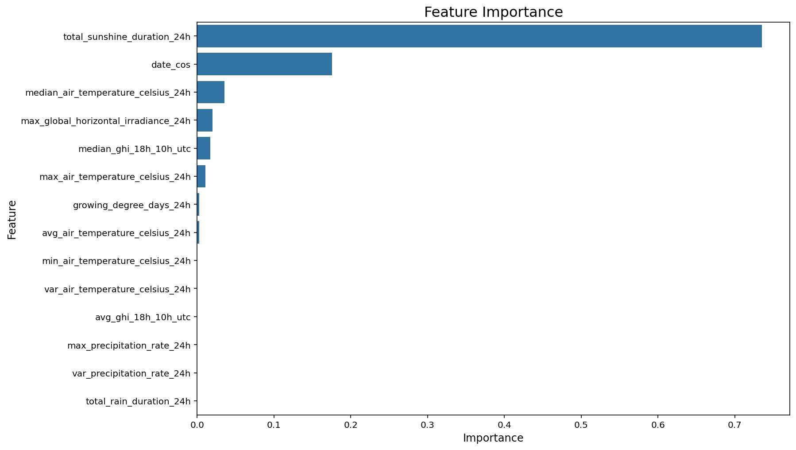
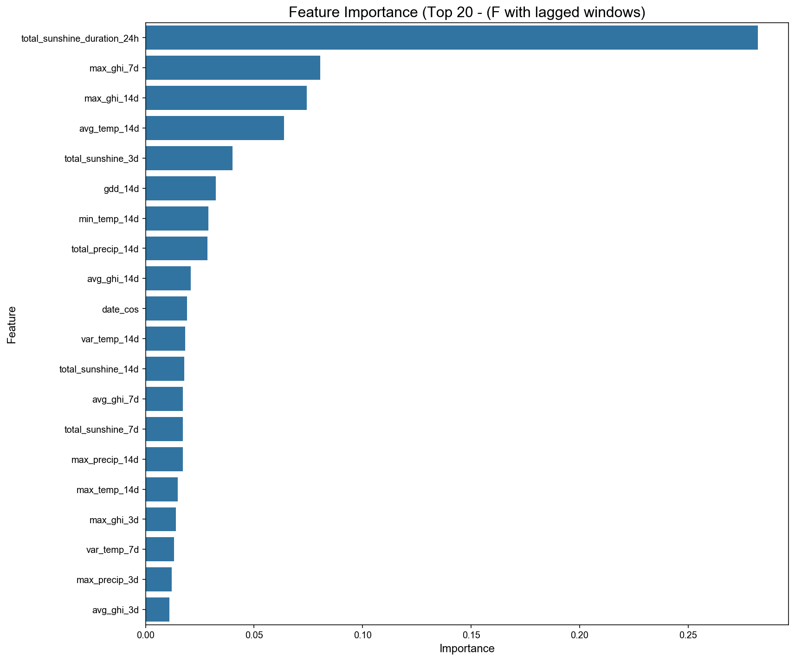

# Grass Growth Rate Prediction – Training Process

This document summarizes the end-to-end training process for predicting **grass growth rate** using weather and farm data.  
Model inputs include:

- Air temperature (air_temperature_celsius)
- Rainfall (precipitation_rate)
- Solar radiation (global_horizontal_irradiance)
- Date (seasonality)
- Farm ID

---

# Step 0: Data Exploration and Quality Checks

### Weather Variables

- **Air Temperature:** -4.0°C to 34.0°C (reasonable range).
- **Solar Radiation (GHI):** 0.0 to 1103.0 W/m² (non-negative, physically consistent).
- **Precipitation Rate:** 0.0 to 20.4 mm/h (high but possible).

No unreasonable values detected.

### Grass Growth Rate

- **Records:** 1852 in total.
- **Range:** 3.5 – 258.1 (kg DM/ha/day).
- **Mean:** 56.78
- **Anomalies:** ~1.46% of values > 120, considered extreme outliers but kept (not truncated).
- **Distribution:** Right-skewed, with long tail and outliers above 120.

<summary>Visualization</summary>
<p align="center">
  
</p>

- **Boxplot:** Outliers clearly visible above 120.
- **Histogram:** Right-skewed distribution with long tail.

### Missing Records

- Weather data collected every **30 minutes**, but some days have only 44–46 records (instead of 48).
- Solution: **interpolation** for small gaps (≤3 consecutive missing records), otherwise leave as NaN.

---

# Step 1: Interpolation of Weather Data

Interpolation rules:

- Linear interpolation applied only for gaps ≤ 3 consecutive records (≤1.5 hours).
- Larger gaps kept as missing, flagged with warnings.
- Ensures consistent **48 records per day** for fair aggregation.

<summary>Core Code (Interpolation of Weather Data)</summary>

```python
# Linear interpolation for small gaps
merged_df[numeric_cols] = merged_df[numeric_cols].interpolate(method='linear')

# Revert interpolation for large gaps (>3 consecutive missing)
merged_df.loc[group_indices, numeric_cols] = np.nan
```

---

# Step 2: Feature Engineering (24h Window)

For each growth rate record, we extract weather statistics from the **preceding 24 hours**:

- **Temperature Features:** mean, min, max, median, variance.
- **Solar Radiation Features:** max GHI, average/median night-time GHI (18:00–10:00 UTC), total sunshine duration.
- **Precipitation Features:** max precipitation, variance, total rain duration.
- **Agronomic Indicator:** Growing Degree Days (GDD, base temperature = 5°C).
- **Seasonality:** Day of year transformed with cosine function (`date_cos`).

<summary>Example Features</summary>

- `avg_air_temperature_celsius_24h`
- `max_global_horizontal_irradiance_24h`
- `total_sunshine_duration_24h`
- `growing_degree_days_24h`
- `date_cos` (captures seasonality for Southern Hemisphere)

---

# Step 3: Baseline Model – Decision Tree Regressor

### Data Preparation

- Filtered to records with >40 weather entries in the 24h window.
- Train/test split: 80% / 20%.
- 10-fold
- StandardScaler applied to features (Though not nessary for DT, but useful for general use).

### Evaluation Metrics

The model is evaluated using three complementary metrics: **R²**, **RMSE**, and **MAE**.

- **R² (Coefficient of Determination)**

  - Measures how well the independent variables explain the variance in the target variable.
  - Provides an overall sense of goodness-of-fit: values closer to 1 indicate better predictive power.
  - Useful for comparing different models trained on the same dataset.

- **RMSE (Root Mean Squared Error)**

  - Penalizes larger errors more heavily because of the squaring operation.
  - Sensitive to outliers, which makes it a good choice when large deviations are especially undesirable.
  - Interpretable in the same units as the target variable (kg DM/ha/day).

- **MAE (Mean Absolute Error)**
  - Represents the average absolute difference between predictions and actual values.
  - Less sensitive to outliers than RMSE, providing a more robust measure of typical model error.
  - Easy to interpret as the expected error magnitude in real-world terms.

✅ Using these three metrics together gives a balanced evaluation:

- **R²** indicates explanatory power.
- **RMSE** highlights sensitivity to large errors.
- **MAE** shows the average error magnitude under normal conditions.

### Model Training

- Used **GridSearchCV** (10-fold) to tune hyperparameters:
  - `max_depth`, `min_samples_split`, `min_samples_leaf`, `ccp_alpha`

**first round search:**

```json
{
    "max_depth": [5, 10, 15, 20, None],
    "min_samples_split": [2, 5, 10, 20],
    "min_samples_leaf": [1, 2, 4, 8],
    "ccp_alpha": [0.0, 0.001, 0.01, 0.1]
  }
```

**Best parameters found after 1st round:**

```json
{
  "ccp_alpha": 0.0,
  "max_depth": 5,
  "min_samples_leaf": 8,
  "min_samples_split": 20
}
```

**Use second round search because some best parameters are on the boundary:**

```json
{
  "max_depth": [3, 4, 5, 6, 7],
  "min_samples_split": [15, 20, 25, 30, 40],
  "min_samples_leaf": [6, 8, 10, 12, 15],
  "ccp_alpha": [0.0, 0.001, 0.005, 0.01]
}
```

**Best parameters found:**

```json
{
  "ccp_alpha": 0.0,
  "max_depth": 4,
  "min_samples_leaf": 12,
  "min_samples_split": 15
}
```

### Evaluation (Test Set)

- **RMSE:** 19.7788
- **MAE:** 14.3411
- **R²:** 0.3898

### Feature Importance

Top predictors:

1. **Total Sunshine Duration (24h)** – 0.74
2. **Seasonality (date_cos)** – 0.18
3. **Median Air Temperature (24h)** – 0.04

<summary>Visualizations</summary>
<p align="center">
  
</p>

- **Actual vs Predicted Scatter Plot**

<p align="center">
  
</p>

- **Feature:** Importance Bar Chart.

---

# Baseline Model Tuning

## 1) Summary of the Two Rounds

| Metric                                  | Round 1 |     Round 2 |           Change |
| --------------------------------------- | ------: | ----------: | ---------------: |
| **RMSE**                                | 20.0398 | **19.7788** |  ↓ 0.26 (better) |
| **MAE**                                 | 14.6012 | **14.3411** |  ↓ 0.26 (better) |
| **R²**                                  |  0.3736 |  **0.3898** | ↑ 0.016 (better) |
| **Model complexity (max_depth)**        |       5 |       **4** |          simpler |
| **Model complexity (min_samples_leaf)** |       8 |      **12** |          simpler |

**My take:** the second round yields a small but consistent improvement across all headline metrics while **reducing model complexity**. This suggests I have found a configuration that generalizes better with less risk of overfitting.

---

## 2) Interpretation

- **Performance improved slightly**: RMSE and MAE both decreased by ~0.26, and R² increased by ~0.016.
- **Model became simpler**: moving from `max_depth=5` to `4` and from `min_samples_leaf=8` to `12` indicates a **more bias‑leaning, less variance‑prone** tree that still performs better. This is an ideal outcome of regularization.
- **Diminishing returns**: Given the marginal gains in Round 2, I expect **additional hyperparameter sweeps** to provide **negligible ROI** relative to the compute/time cost.

---

## 3) Where the Bottleneck Is

Even after tuning, **R² = 0.3898**, i.e., the model explains ~**39%** of the variance in the target. This strongly suggests that my limit right now is **not** the hyperparameters but the **signal capacity** in the current setup:

- **Feature limitations**: the available features likely do not capture all the drivers of pasture growth.
- **Model class limitations**: a **single decision tree** has restricted representational power and tends to underfit complex, nonlinear interactions.

---

## 4) Next Steps (Higher‑Leverage Directions)

### A) Try stronger model families

- **Random Forest** — averages many de‑correlated trees, reducing variance and typically outperforming a single tree baseline.
- **Gradient Boosting (e.g., XGBoost / LightGBM)** — sequentially corrects residuals and is often state‑of‑the‑art on tabular problems.

### B) Invest in feature engineering

- **Interaction features** (e.g., _sunlight duration × mean temperature_) to capture multiplicative effects on growth.
- **Lagged/rolling features** (e.g., _7‑day mean temperature_, _3‑day cumulative rainfall_) to model cumulative/physiological responses.
- **Domain‑informed features** (e.g., soil moisture proxies, fertilization, soil type/management patterns) if data is available or can be sourced.

---

## 5) Decision

I will **freeze the Round‑2 tree** as my **Baseline Model** and **pivot** to:

1. building **ensemble models** (Random Forest, Gradient Boosting), and
2. expanding **feature engineering** with lags/interactions and domain signals.

Further micro‑tuning of the single tree is unlikely to change outcomes materially, whereas ensembles and richer features should move the R² ceiling more meaningfully.

---

<br>

# Step 4 & Step 5 — Model Tuning Notes (Random Forest & XGBoost)

## 1) Baseline for Context — Tuned Decision Tree

| Model                     |     R² (↑) |    RMSE (↓) |     MAE (↓) |
| ------------------------- | ---------: | ----------: | ----------: |
| **Decision Tree (tuned)** | **0.3898** | **19.7788** | **14.3411** |

---

## 2) Step 4 — Random Forest (Training & Tuning)

### 2.1 Setup

- **Estimator**: `RandomForestRegressor(random_state=42)`
- **Search**: `GridSearchCV(cv=10, n_jobs=-1, scoring='neg_mean_squared_error', verbose=2)`

**Round-1 grid**

```python
{
    'n_estimators': [100, 150, 200],
    'max_depth': [5, 10, 15, None],
    'min_samples_split': [2, 5, 10],
    'min_samples_leaf': [1, 2, 4]
}
```

### 2.2 Findings (Round-1)

- **Best params**: `{'max_depth': 10, 'min_samples_leaf': 4, 'min_samples_split': 10, 'n_estimators': 200}`
- **Test**: **RMSE = 19.2146**, **MAE = 13.5861**, **R² = 0.4241**
- **Note**: Several best values sat on grid edges (`n_estimators`, `min_samples_leaf`, `min_samples_split`) → likely room just beyond the current grid.

**Round-2 grid (shifted & narrowed)**

```python
{
    'max_depth': [8, 10, 12],
    'n_estimators': [200, 250, 300],
    'min_samples_leaf': [4, 6, 8],
    'min_samples_split': [10, 12, 15]
}
```

### 2.3 Findings (Round-2)

- **Best params**: `{'max_depth': 8, 'min_samples_leaf': 8, 'min_samples_split': 10, 'n_estimators': 300}`
- **Test**: **RMSE = 19.1487**, **MAE = 13.5495**, **R² = 0.4281**
- **Interpretation**: Positive but minor gains over Round-1 (ΔR² ≈ +0.004). This is a clear signal of **diminishing returns** from further micro-tuning on the current feature set.

**Note**: Moving from a single tree to a bagged ensemble materially improved generalization (R² ≈ 0.39 → 0.42+). Further grids are likely to be compute-expensive for marginal gains.

---

## 3) Step 5 — XGBoost (Training & Tuning)

### 3.1 Setup

- **Estimator**: `xgb.XGBRegressor(objective='reg:squarederror', random_state=42)`
- **Search**: `GridSearchCV(cv=10, n_jobs=-1, scoring='neg_mean_squared_error', verbose=2)`

**Grid**

```python
{
    'n_estimators': [100, 200, 300],
    'max_depth': [3, 5, 7],
    'learning_rate': [0.01, 0.1, 0.2],
    'subsample': [0.8, 1.0],
    'colsample_bytree': [0.8, 1.0]
}
```

### 3.2 Findings

- **Best params**: `{'colsample_bytree': 0.8, 'learning_rate': 0.01, 'max_depth': 5, 'n_estimators': 300, 'subsample': 1.0}`
- **Test**: **RMSE = 19.2199**, **MAE = 13.5914**, **R² = 0.4238**
- **Interpretation**: I could extend `n_estimators > 300`, but the tiny gap to RF and added cost didn’t justify a deeper sweep.

---

## 4) Final Comparison (Best of Each Family)

| Model (best tuned)               |     R² (↑) |    RMSE (↓) |     MAE (↓) |
| -------------------------------- | ---------: | ----------: | ----------: |
| Decision Tree (tuned baseline)   |     0.3898 |     19.7788 |     14.3411 |
| **Random Forest (Round-2 best)** | **0.4281** | **19.1487** | **13.5495** |
| XGBoost (best)\*\*               |     0.4238 |     19.2199 |     13.5914 |

**Conclusion**: On this feature set, **Random Forest** narrowly leads **XGBoost**. The two converge around **R² ≈ 0.42–0.43**, suggesting a **feature-limited ceiling**, not a tuning failure.

<summary>Visualizations</summary>
<p align="center">
  
</p>

- **Actual vs Predicted Scatter Plot (RF):** By comparing it with the Decision Tree’s actual vs. predicted scatter plot, it’s clear that the Random Forest delivers better predictive performance (higher R², lower RMSE).

<p align="center">
  
</p>

- **Actual vs Predicted Scatter Plot (Decesion Tree)**

---

## 5) Decision & Next Work

- **Freeze** the RF Round-2 model as the **current reference**.
- **Stop** further micro-grids (diminishing returns).
- **Shift focus** to **Feature Engineering** and **Data Enrichment**:
  - Lags/rolling windows (e.g., 3–7–14 day aggregates).
  - Interactions (e.g., _sun × temp_).
  - Domain features (soil moisture/management), if available.

<br>

---

# Step 6 & Step 7 — Feature Engineering → Final Random Forest Tuning (Big Gain over 24h-Only Baseline)

## 1) Objective & Context

- **Goal**: improve the Random Forest that previously used only **24h features** (best **R² = 0.4281**).
- **Approach**: engineer **3/7/14-day** lagged & interaction features from high-frequency weather, merge with 24h features, retrain RF, and finally **re-tune RF** on the full feature set.

---

## 2) Feature Engineering (Step 6)

For each labeled timestamp per farm, I built **lagged windows** over the past **3, 7, 14 days**, computing:

- **Temperature**: `avg/min/max/var` over the window.
- **Solar/GHI**: `avg_ghi_{wd}`, `max_ghi_{wd}`, and **sunshine hours** via a simple GHI threshold:
  - `total_sunshine_{wd} = count(GHI > 25 W/m²) × 0.5 h` (half-hour steps).
- **Precipitation**: `total_precip_{wd} = sum(rate) × 0.5` (approx. mm per half-hour bins), `max_precip_{wd}`.
- **Thermal time**: **GDD** with base 5°C from daily max/min:
  - `gdd_{wd} = Σ_{days} max(((Tmax + Tmin)/2 − 5), 0)`.
- **Interactions** (example 7-day window):
  - `inter_temp_sunshine_7d = avg_temp_7d × total_sunshine_7d`
  - `inter_temp_precip_7d = avg_temp_7d × total_precip_7d`

Then I **merged** these with the existing 24h features on `farm_id` + `growth_rate_timestamp`, dropped rows with missing values, and formed the final matrix.

**Merge result**: `final_df` shape **(1852, 50)**

---

## 3) Training on the Enriched Feature Set (Step 6)

- **Split**: 80/20 train–test, `random_state=42`.
- **Scaling**: `StandardScaler` on train, applied to test (kept consistent with previous experiments).
- **Model**: RandomForest with the previously strong params on 24h-only set:  
  `{'max_depth': 8, 'min_samples_leaf': 8, 'min_samples_split': 10, 'n_estimators': 300, 'random_state': 42, 'n_jobs': -1}`

### Step 6 Results (Full Feature Set, RF w/ prior best params)

| Metric   |        Test |
| -------- | ----------: |
| **RMSE** | **16.3570** |
| **MAE**  | **11.8789** |
| **R²**   |  **0.5255** |

**Gain vs 24h-only baseline**: **R² 0.4281 → 0.5255** (**+22.75%** relative).

**Top signals (sample)**: `total_sunshine_duration_24h`, `max_ghi_7d`, `max_ghi_14d`, `avg_temp_14d`, `total_sunshine_3d`, `gdd_14d`, `min_temp_14d`, `total_precip_14d` — long-horizon light/thermal exposure and sunshine duration rank highly.

---

## 4) Final RF Grid Search on the Full Feature Set (Step 7)

- **Search**: 10-fold CV over **36 candidates** (focused grid around depths/leaves/trees informed by Step 6).
- **Best params**: `{'max_depth': 12, 'min_samples_leaf': 6, 'min_samples_split': 10, 'n_estimators': 300}`

### Step 7 Results (Best RF on full feature set)

| Metric   |        Test |
| -------- | ----------: |
| **RMSE** | **16.1086** |
| **MAE**  | **11.6918** |
| **R²**   |  **0.5398** |

**Gain vs 24h-only baseline**: **R² 0.4281 → 0.5398** (**+26.09%** relative).

<summary>Visualizations</summary>
<p align="center">
  
</p>

- **Actual vs Predicted Scatter Plot**

<p align="center">
  
</p>

- **Feature:** Importance Bar Chart.

**Observation**: The **bulk of improvement came from feature engineering**; the subsequent grid search delivered a **smaller but consistent** bump (0.5255 → 0.5398). Some best values sat at grid edges (e.g., `n_estimators=300`), but returns are **clearly diminishing** relative to the compute cost and current signal ceiling.

---

## 6) End-to-End Results Comparison (Baseline → Ensembles → Final)

| Model / Stage                                    | RMSE (↓) | ΔRMSE vs. Baseline | MAE (↓) | ΔMAE vs. Baseline | R² (↑) | ΔR² vs. Baseline |
| ------------------------------------------------ | -------: | -----------------: | ------: | ----------------: | -----: | ---------------: |
| Decision Tree — tuned **baseline**               |  19.7788 |                  — | 14.3411 |                 — | 0.3898 |                — |
| Random Forest — default params                   |  19.7411 |            -0.0377 | 14.0550 |           -0.2861 | 0.3921 |          +0.0023 |
| Random Forest — GridSearch **Round-1**           |  19.2146 |            -0.5642 | 13.5861 |           -0.7550 | 0.4241 |          +0.0343 |
| Random Forest — GridSearch **Round-2**           |  19.1487 |            -0.6301 | 13.5495 |           -0.7916 | 0.4281 |          +0.0383 |
| XGBoost — best tuned                             |  19.2199 |            -0.5589 | 13.5914 |           -0.7497 | 0.4238 |          +0.0340 |
| **Step 6** — RF on **enriched features**         |  16.3570 |            -3.4218 | 11.8789 |           -2.4622 | 0.5255 |          +0.1357 |
| **Step 7** — RF on enriched features (**final**) |  16.1086 |            -3.6702 | 11.6918 |           -2.6493 | 0.5398 |          +0.1500 |

<p align="center">
  
  
  
</p>
## 7) What the Model Learned (High Level)

- **Sunlight exposure** (24h duration + multi-day maxima/averages) and **multi-week thermal context** (14-day averages & GDD) are dominant.
- **Precipitation over longer windows** matters, but less than light/temperature in this dataset.
- The enriched set captures **cumulative physiological effects** better than the 24h snapshot alone, explaining the lift.

---

## 8) Decision & Next Steps

- **Freeze**: the Step‑7 Random Forest (**R² ≈ 0.54**) as the **final model** for this phase.
- **Stop**: additional RF hyperparameter searches — **diminishing returns**.
- **Focus** next on:
  - **Error analysis** (study largest residuals by farm/season/regime from `actual_vs_predicted_final.png`).
  - **Richer features**: rolling variability (e.g., 7‑day rolling std), **EWMA** of temp/GHI/precip, regime flags.
  - **External data**: soil moisture/temperature, fertiliser/management events, pasture species — likely required to push **R² toward 0.6–0.7**.

---

**Bottom line**: **Feature engineering** unlocked the major lift; **tuning** polished it. The resulting RF improves the 24h-only baseline by **~26% R²**, **~19% RMSE** and **~18% MAE** with markedly better generalization.
